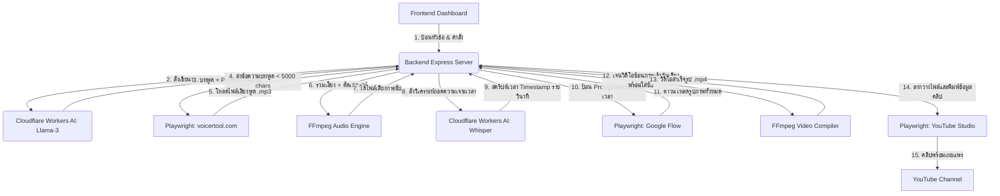

# สถาปัตยกรรมระบบ (System Architecture) - Auto YouTube

เอกสารนี้แสดงโครงสร้างและการไหลของข้อมูล (Data Flow) ในการสร้างคลิปวิดีโอ YouTube แบบอัตโนมัติ

---

## 1. แผนผังการทำงานโดยภาพรวม (Overall Flow)

---

## 2. รายละเอียดสเต็ปสำคัญ

### Step A: เขียนสคริปต์ (Script Generation)
- ระบบส่งความต้องการของผู้ใช้ไปที่ **Cloudflare Workers AI** (ใช้โมเดล Llama 3)
- ให้ได้บทพูดภาษาไทยที่มีโครงสร้างเป็น **พาร์ท ๆ** (แต่พาร์ทไม่เกิน 4000 ตัวอักษร เพื่อเผื่อพื้นที่ให้ Voicertool)
- แต่ละพาร์ทจะถูกสร้าง **Prompt สำหรับไปเจนภาพ** ที่สอดคล้องกับเนื้อเรื่องแนบมาด้วย

### Step B: สร้างเสียงพูด (TTS Generation)
- บอท Playwright เปิดหน้าเว็บ `https://voicertool.com/`
- นำบทพูดทีละพาร์ทไปกรอก เลือกเสียงภาษาไทย (Ava / อื่นๆ) แล้วกดสร้าง
- รอเสียงเสร็จแล้วดาวน์โหลดไฟล์ `.mp3` ออกมาทีละส่วน

### Step C: บีบเสียงพูด (Audio Post-processing)
- ใช้ **FFmpeg** ต่อไฟล์เสียงเข้าด้วยกัน
- ใช้ฟิลเตอร์ `silenceremove` ของ FFmpeg เพื่อลบความเงียบที่ยาวเกินไป (เช่น ช่วงหยุดหายใจ 0.5 วินาทีขึ้นไป) ให้เสียงพูดกระชับ น่าฟังแบบสไตล์ยูทูปเบอร์

### Step D: ถอดความทำ Timestamp (Timestamp Alignment)
- นำไฟล์เสียงกระชับส่งไปที่ **Cloudflare Whisper AI**
- ให้ Whisper เจนสคริปต์รายวินาทีว่า "คำพูดไหนพูดที่วินาทีที่เท่าไร"
- นำจุดเวลานี้มาคำนวณว่าในแต่ละช่วงเวลาของเสียง ต้องสลับรูปภาพภาพไหนบ้าง

### Step E: เจนภาพด้วย Google Flow (Visual Generation)
- บอท Playwright นำ Prompt ที่เตรียมไว้จาก Step A ไปกรอกบนเว็บ Google Flow
- สั่งสร้างรูปภาพ ดาวน์โหลดมาเก็บไว้

### Step F: ประกอบวิดีโอ (Video Rendering)
- แปลงช่วงเวลาของคำพูดเป็นไฟล์ซับไตเติลภาษาไทย (`.srt`)
- ใช้ **FFmpeg** นำรูปภาพทั้งหมดสไลด์แสดงผลตามช่วงเวลาของเสียง (เช่น รูป 1 แสดง 0-5 วิ, รูป 2 แสดง 5-12 วิ)
- ผสมแทร็กเสียงพูดเข้าไป และทำเอฟเฟกต์ซูมภาพเบา ๆ (Ken Burns Effect) เพื่อเพิ่มมิติ
- ฝังไฟล์ซับไตเติลลงบนวิดีโอ เพื่อให้ดูง่าย

### Step G: อัปโหลด YouTube
- บอท Playwright เปิดหน้า YouTube Studio ผ่านเซสชันเบราว์เซอร์ที่จดจำการล็อกอินไว้
- อัปโหลดไฟล์วิดีโอ ใส่ชื่อ รายละเอียดที่เตรียมไว้ แล้วตั้งค่าเป็น Private Draft รอให้ผู้ใช้ไปกดยืนยันเผยแพร่
