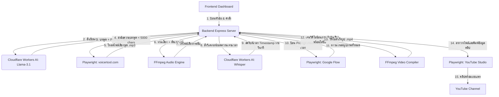

# แผนผังโครงสร้างระบบ (System Architecture) - Auto YouTube

เอกสารพิมพ์เขียวแสดงเทคโนโลยีและเส้นทางการไหลของข้อมูลสำหรับการสร้างวิดีโออัตโนมัติ

---

## 🚀 เทคโนโลยีที่ใช้งาน (Tech Stack)
- **Frontend Control Panel**: Vanilla HTML5 / Vanilla CSS3 / Vanilla Javascript (Deploy บน Cloudflare Pages)
- **Backend Automation Engine**: Node.js (Express, Playwright) + Local FFmpeg (รันโลคอลบนเครื่องคอมพิวเตอร์)
- **AI Models**: Cloudflare Workers AI (Llama 3.1 สำหรับสคริปต์ / Whisper สำหรับคีย์เวลาซับไตเติล)
- **Database**: Local File System (บันทึกวิดีโอและไฟล์เสียงลงโฟลเดอร์โดยตรง ไม่ใช้ฐานข้อมูลภายนอก)

---

## 📁 โครงสร้างโฟลเดอร์หลัก (Directory Structure)
- [backend/automations/](file:///d:/antigravity/auto%20youtube/backend/automations/) - สคริปต์บอท Playwright แยกตามเว็บเป้าหมาย (Voicertool, Google Flow, YouTube)
- [backend/](file:///d:/antigravity/auto%20youtube/backend/) - ตัวรับคำสั่ง (API Server), สคริปต์รัน FFmpeg จัดการเสียงและวิดีโอ
- [frontend/](file:///d:/antigravity/auto%20youtube/frontend/) - โฟลเดอร์หน้าแอปควบคุมแดชบอร์ดที่ Deploy บน Cloudflare
- [docs/](file:///d:/antigravity/auto%20youtube/docs/) - แหล่งรวบรวมข้อมูลกฎการเขียนโค้ดและตำแหน่งปุ่มกดบอท

---

## 🔄 แผนผังลำดับการทำงาน (Data Flow)

