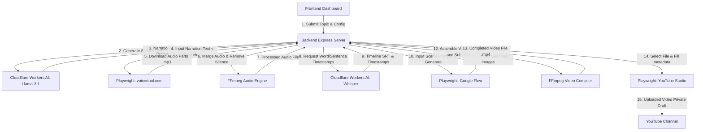

# System Architecture - Auto YouTube

Technical blueprint showing the tech stack and data flow for the automated video generation pipeline.

---

## 🚀 Tech Stack
- **Frontend Control Panel**: Vanilla HTML5 / Vanilla CSS3 / Vanilla Javascript (Deployed on Cloudflare Pages)
- **Backend Automation Engine**: Node.js (Express, Playwright) + Local FFmpeg (Runs locally on host machine)
- **AI Models**: Cloudflare Workers AI (Llama 3.1 for script gen / Whisper for audio timestamp analysis)
- **Database**: Local File System (Saves videos, audios, and images directly to local folders, no external database)

---

## 📁 Key Directory Structure
- [backend/automations/](file:///d:/antigravity/auto%20youtube/backend/automations/) - Playwright bots for Voicertool, Google Flow, and YouTube Studio.
- [backend/](file:///d:/antigravity/auto%20youtube/backend/) - Express server APIs, FFmpeg wrapper logic for audio and video assembly.
- [frontend/](file:///d:/antigravity/auto%20youtube/frontend/) - Web dashboard assets deployed on Cloudflare.
- [docs/](file:///d:/antigravity/auto%20youtube/docs/) - System specifications, selectors map, and coding rules.

---

## 🔄 Data Flow Map

